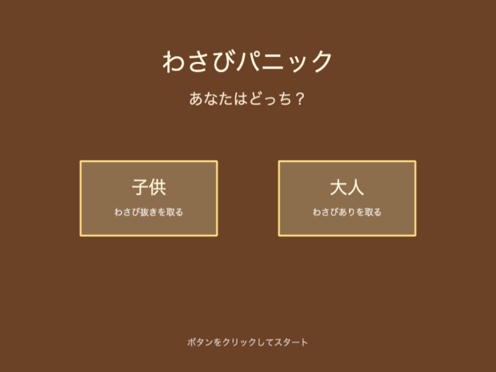
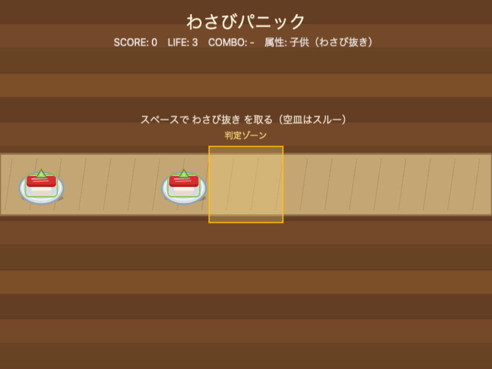

# わさびパニック

日本の回転寿司をテーマにした、カジュアルなタイミングゲームのプロトタイプです。  
流れてくるお寿司から、自分の属性に合ったものをタイミングよく取りましょう。

## スクリーンショット

### 属性選択



### プレイ画面



## ゲーム概要

プレイ前に **子供** または **大人** を選びます。

| 属性 | 取るお寿司 |
| --- | --- |
| 子供 | わさび抜き |
| 大人 | わさびあり |

コンベアの中央にある判定ゾーンで、スペースキーを押して寿司を取ります。自分向きでない寿司や空のトラップ皿は、スルーしてかまいません。

## 遊び方

1. `npm run dev` で起動し、ブラウザでゲームを開く
2. タイトルで **子供** / **大人** を選ぶ
3. 寿司が判定ゾーンに入ったら **スペースキー** で取る
4. ライフが 0 になるとゲームオーバー。リトライで属性選択に戻る

### ルール

| 結果 | 内容 |
| --- | --- |
| 正解 | スコア加算（コンボで倍率アップ） |
| 取り間違い / トラップ取得 / 自分向きの見逃し | ライフ -1、コンボリセット |
| 自分向きでない寿司・空皿のスルー | ペナルティなし |

### ゲーム要素

- **コンボ** … 連続正解で得点倍率が上がる（最大 ×5）
- **トラップ皿** … たまに流れる空皿。取るとミス
- **スピードアップ** … 一定スコアごとに寿司が速くなる
- **効果音** … 正解・ミス・加速・ゲームオーバーなど（Web Audio による合成音）

## 技術スタック

| 種別 | 技術 |
| --- | --- |
| 言語 | TypeScript |
| バンドラ / 開発サーバ | Vite |
| ゲームエンジン | Phaser 3 |
| 描画 | Phaser Graphics（外部画像アセットなし） |
| 効果音 | Web Audio API |

画面サイズは **800×600** 固定です。

## はじめ方

```bash
npm install
npm run dev
```

ブラウザで表示された URL（通常は `http://localhost:5173/`）を開いてください。

### その他のコマンド

```bash
npm run build    # 本番ビルド
npm run preview  # ビルド結果の確認
```

## ディレクトリ構成

```
src/
  main.ts                 # Phaser ゲーム起動
  game/
    scenes/
      BootScene.ts        # 起動・遷移
      SelectScene.ts      # 属性選択
      GameScene.ts        # プレイ本体
    audio/
      SoundFx.ts          # 効果音
docs/
  wasabi-panic-plan.md    # 開発計画書
  images/                 # README 用スクリーンショット
scripts/
  capture-screenshots.mjs # 画面キャプチャ用スクリプト
```

## ライセンス

[MIT License](LICENSE) です。
