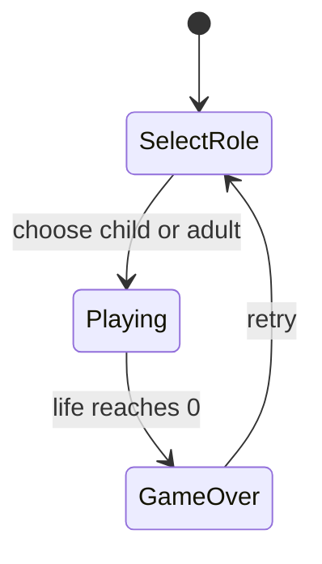

# わさびパニック — プロトタイプ開発計画書

> **改訂履歴**
> - 初版: 合格／不合格の仕分けゲームとして定義
> - 改訂: プレイ前に属性（子供／大人）を選び、自分向きの寿司だけを「取る」ゲームへ変更

## 1. 概要

「わさびパニック」は、流れてくるお寿司から、自分の属性に合ったものをタイミングよく取るカジュアルゲームのプロトタイプである。

- **テーマ**: 日本の回転寿司／わさびの好み
- **体験の核**:
  1. プレイ前に属性（**子供** or **大人**）を選ぶ
  2. 子供は**わさび抜き**、大人は**わさびあり**の寿司を取る
- **技術スタック**: TypeScript + Vite + Phaser 3（既存リポジトリ構成をそのまま利用）
- **画面サイズ**: 800×600（固定）。[`src/main.ts`](../src/main.ts) の `width` / `height` と一致させる

本計画書は、プレイ可能な最小プロトタイプまでの実装方針・フェーズ・受け入れ条件を定義する。画像アセットや高度な演出はスコープ外とする。

### 1.1 仕様変更でやめたこと

| 旧仕様 | 新仕様 |
| --- | --- |
| 左キー＝普通を合格、右キー＝わさびを不合格 | 属性に合う寿司を「取る」 |
| 合格／不合格のラベル | 属性表示と「取る」操作の案内 |
| 全寿司を仕分ける | 自分向きの寿司を狙い、それ以外はスルー可 |

---

## 2. ゲーム仕様

### 2.1 画面・見た目

| 項目 | 内容 |
| --- | --- |
| 解像度 | 800×600 固定 |
| 背景 | 和風の木目調をイメージした茶色系 |
| レーン | 画面を横断するコンベア帯。左から右へ寿司（皿付き）が流れる |

見た目の方向性（実装済みの方針を維持）:

- 陶器（青白）の皿の上に握りを載せる
- マグロはいらすとや風の「俵型シャリ＋薄い切り身」
- わさびありは緑の山盛り＋寿司本体の緑アウトライン

### 2.2 レーンの動き

- お寿司は画面**左**から出現し、コンベアに乗って**右**へ一定速度で移動する
- 出現は**一定間隔**で行う（チューニング初期案は後述）
- Phaser の `Graphics` で描画する（外部画像不要）

### 2.3 プレイヤー属性

プレイ開始前に属性を 1 つ選ぶ。

| 属性 | 取るべき寿司 | HUD 表示例 |
| --- | --- | --- |
| 子供 | わさび抜き（`noWasabi`） | 「子供：わさび抜きを取ろう」 |
| 大人 | わさびあり（`withWasabi`） | 「大人：わさびありを取ろう」 |

### 2.4 お寿司の種類（2種類）

| 種類 | `type` | 見た目 | 誰が取るか |
| --- | --- | --- | --- |
| わさび抜き | `noWasabi` | 皿＋マグロ握り | 子供 |
| わさびあり | `withWasabi` | 皿＋マグロ＋わさび山＋緑枠 | 大人 |

スポーン時にどちらかをランダム（比率はチューニング）で決定する。

### 2.5 操作と判定（確定方針）

- 画面**中央**に判定ゾーンを設ける
- 寿司が判定ゾーン内にいるとき、**スペースキー**でその寿司を「取る」
- ゾーン外の入力は無効
- 左右矢印による合格／不合格仕分けは廃止する

| 結果 | 条件 | 効果 |
| --- | --- | --- |
| 正解 | ゾーン内の寿司が属性と一致し、取った | スコア **+100**、寿司を除去 |
| 取り間違い | 属性と合わない寿司を取った | ライフ **-1**、寿司を除去 |
| 見逃し | **自分向きの寿司**が右端まで流れた | ライフ **-1**、寿司を破棄 |
| スルー | 自分向きでない寿司が右端まで流れた | ペナルティなし（破棄のみ） |

### 2.6 スコア・ライフ・ゲームオーバー

| 項目 | 内容 |
| --- | --- |
| ライフ初期値 | **3** |
| ライフ 0 | **GAME OVER**。「GAME OVER」とリトライを表示 |
| リトライ | スコア・ライフ・レーンを初期化。属性選択からやり直す |

---

## 3. 技術方針

既存の Phaser プロジェクト慣習に合わせ、早すぎる抽象化は避ける。

### 3.1 Scene 構成

```
BootScene → SelectScene（属性選択） → GameScene（プレイ）
```

- [`BootScene`](../src/game/scenes/BootScene.ts) は `SelectScene` へ遷移する
- 属性は `this.scene.start("Game", { role: "child" | "adult" })` のように data で渡す
- ゲームオーバー UI は `GameScene` 内オーバーレイで完結させる
- リトライは `SelectScene` へ戻す（属性を選び直せるようにする）

### 3.2 描画・アセット

- 外部画像・音声アセットは使わない（いらすとや等の画像ファイルは利用しない。図形で雰囲気を再現）
- Phaser の `Graphics` / Text で描画する

### 3.3 移動・衝突

- 物理エンジンは使わない
- `update` で X 座標を加算して流す
- 判定ゾーンは中央の X 範囲の数値比較

### 3.4 入力・UI

- 属性選択: クリックまたは ←→＋Enter／数字キーなど、わかりやすい UI
- プレイ中: `Space` で「取る」（`JustDown`）
- スコア・ライフ・現在の属性を HUD 表示

### 3.5 配置予定ファイル

| ファイル | 役割 |
| --- | --- |
| `src/main.ts` | 解像度・背景色・Scene 登録 |
| `src/game/scenes/BootScene.ts` | 起動・遷移 |
| `src/game/scenes/SelectScene.ts` | 子供／大人の属性選択（新規） |
| `src/game/scenes/GameScene.ts` | プレイ・HUD・ゲームオーバー |

寿司型や定数が Scene を圧迫する場合のみ、`src/game/` 配下に小さなモジュールを分離する。

---

## 4. 画面・オブジェクト設計

### 4.1 属性選択画面（概念）

```
┌────────────────────────────────────────┐
│           わさびパニック                 │
│     あなたはどっち？                     │
│                                        │
│   [ 子供 ]          [ 大人 ]            │
│  わさび抜きを取る    わさびありを取る      │
└────────────────────────────────────────┘
```

### 4.2 プレイ画面（概念）

```
┌────────────────────────────────────────┐
│ SCORE: 0   LIFE: 3   属性: 子供         │
│            スペースで取る               │
│              ┌判定ゾーン┐               │
│ ═════════════╪══════════╪═════════════ │
│  → 皿寿司 →  │  ●寿司   │ → → → → →   │
│ ═════════════╪══════════╪═════════════ │
└────────────────────────────────────────┘
```

- 旧UIの「← 合格」「不合格 →」は削除する
- 判定ゾーンと操作案内（スペースで取る／自分のターゲット表示）を置く

### 4.3 寿司オブジェクト

| 属性 | 説明 |
| --- | --- |
| `type` | `"noWasabi"` \| `"withWasabi"` |
| `x`, `y` | 位置（Y はレーン中央で固定） |
| `resolved` | 取得済みかどうか（二重判定防止） |
| 見た目 | 皿＋握り。`withWasabi` のときわさび山と緑枠 |

### 4.4 HUD

- スコア、ライフ、現在属性（子供／大人）
- ゲームオーバー時: 「GAME OVER」＋リトライ（属性選択へ）

---

## 5. コアロジック

### 5.1 メインループ（Playing）

1. **スポーン**: 一定間隔で左端に寿司を生成し、種類を決定する
2. **移動**: 未解決の寿司を右へ移動する
3. **入力**: スペースでゾーン内寿司を取る → 属性と照合
4. **右端到達**:
   - 自分向き → 見逃し（ライフ -1）
   - それ以外 → ペナルティなしで破棄
5. **ゲームオーバー**: ライフ 0 で停止＋オーバーレイ

### 5.2 取得判定

```
スペース入力
  └─ 判定ゾーン内に未解決の寿司があるか？
        ├─ ない → 何もしない
        └─ ある → type が属性のターゲットと一致するか？
              ├─ 一致 → スコア +100、除去（OK）
              └─ 不一致 → ライフ -1、除去（ミス）
```

属性とターゲットの対応:

- `child` → `noWasabi`
- `adult` → `withWasabi`

### 5.3 状態遷移



---

## 6. 実装フェーズと現状

| フェーズ | 内容 | 状態 |
| --- | --- | --- |
| 1. 見た目の土台 | 背景・コンベア・判定ゾーン | **完了** |
| 2. スポーンと移動 | 寿司生成・2種見た目・右移動 | **完了** |
| 3. 入力（旧） | 左右キーの合格／不合格仕分け | **廃止済み**（属性取得に置換） |
| 3'. 属性選択 | `SelectScene` 追加、属性を Game に渡す | **完了** |
| 3''. 取得操作への置換 | スペースで取る／属性照合／スルー規則 | **完了** |
| 4. スコア・ライフ・終了 | +100、ライフ、見逃し、GAME OVER、リトライ | **完了** |
| 5. プレイ感調整 | 速度・間隔・ゾーン幅・出現比率 | **完了** |

プロトタイプ計画上の主要フェーズは一通り完了。追加の演出や難易度上昇はスコープ外として、必要なら別途検討する。

---

## 7. チューニング値（フェーズ5確定）

| パラメータ | 値 |
| --- | --- |
| 寿司の移動速度 | **160 px/秒**（ゾーン内の反応時間は約1秒） |
| 出現間隔 | **1450 ms** |
| 判定ゾーン幅 | **160 px** |
| わさびあり出現率 | **50%** |
| 皿込みサイズ | 72×52 px |

---

## 8. 受け入れ条件

プロトタイプ完成とみなす条件:

1. 起動後に子供／大人を選べる
2. 800×600・茶色系背景で、皿付きのわさび抜き／あり寿司が流れる
3. 子供はわさび抜き、大人はわさびありをスペースで取ると +100 になる
4. 取り間違い、および自分向き寿司の見逃しでライフが減り、0 で GAME OVER → 属性選択に戻れる
5. 自分向きでない寿司のスルーはライフが減らない
6. `npm run dev` で上記を一通り確認できる

---

## 9. スコープ外（プロトタイプではやらないこと）

- 本格的なスプライト・公式素材の利用・効果音・BGM
- 難易度の段階的上昇やコンボ、ハイスコア保存
- モバイル／タッチ操作対応
- 物理エンジンや過剰な Scene 分割

---

## 10. 確定方針メモ（レビュー用）

計画更新時に置いた前提。違う場合はここを直してから実装する。

1. 操作は **スペースで「取る」**（左右の合格／不合格は廃止）
2. ライフ減は **取り間違い** と **自分向きの見逃し** のみ
3. 自分向きでない寿司は **スルー可**（右端到達でも減らない）
4. リトライは **属性選択から** やり直す
